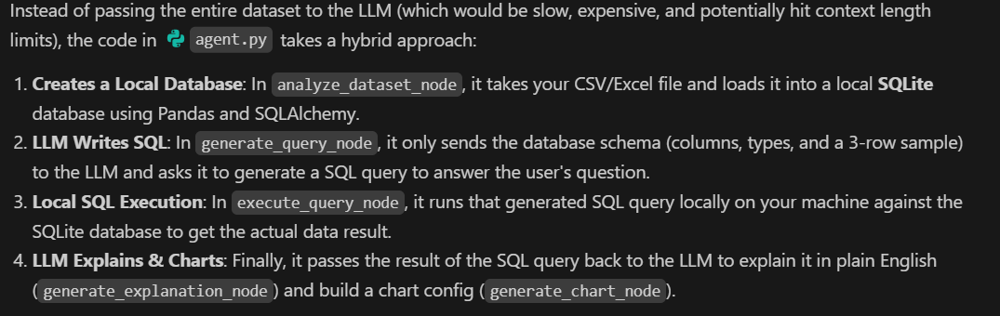
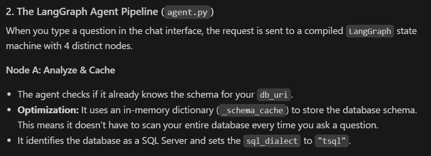

## Conversational Analytics Dashboard 📊

## [https://data-chit-chat.vercel.app/](https://data-chit-chat.vercel.app/)

This application allows users to interact with their data using natural language. Whether you are uploading a CSV/Excel/JSON file or connecting directly to a live SQL Server database, this application empowers you to ask questions, receive intelligent summaries, view tabular data, and see dynamically generated charts.

## ✨ Key Features

- **Natural Language Querying:** Ask complex questions about your data in plain English. No SQL or Python knowledge required.
- **Multi-Source Data Integration:** 
  - Upload static datasets (`.csv`, `.xlsx`, `.json`).
  - Connect directly to live **SQL Server** databases via connection strings.
- **Optimized Backend:**
  - The Python backend uses **SQLAlchemy to execute the generated SQL.**
  > result = pd.read_sql(state["sql_query"], engine)
  - **Schema Caching:** Prevents redundant database scanning by caching table schemas in memory, dramatically reducing latency.
  - **Single LLM Call:** Combines SQL generation, visualization decisions, and natural language summarization into a single structured LLM call to save time and API costs.
- **Export to PDF:** Easily export your chat history and generated insights to PDF for reporting.

---

## 🛠️ Technology Stack

### Frontend
- **Framework:** React + Tailwind CSS
- **Charting:** Recharts (Responsive bar, line, pie, and scatter charts)
- **Markdown Processing:** `react-markdown`, `remark-gfm`

### Backend
- **Framework:** FastAPI
- **Agent Orchestration:** LangGraph + LangChain
- **LLM:** `langchain-google-genai`
- **Data Processing & Execution:** Pandas, SQLAlchemy (SQL Server & SQLite dialects)

---

---

- Start FastAPI backend (`uvicorn main:app --reload`).
- Start Vite frontend (`npm run dev`).
- Render start command **gunicorn main:app --workers 1 --worker-class uvicorn.workers.UvicornWorker --bind 0.0.0.0:$PORT**

> Use Gunicorn to manage the server process, but use Uvicorn to actually run the FastAPI application.
